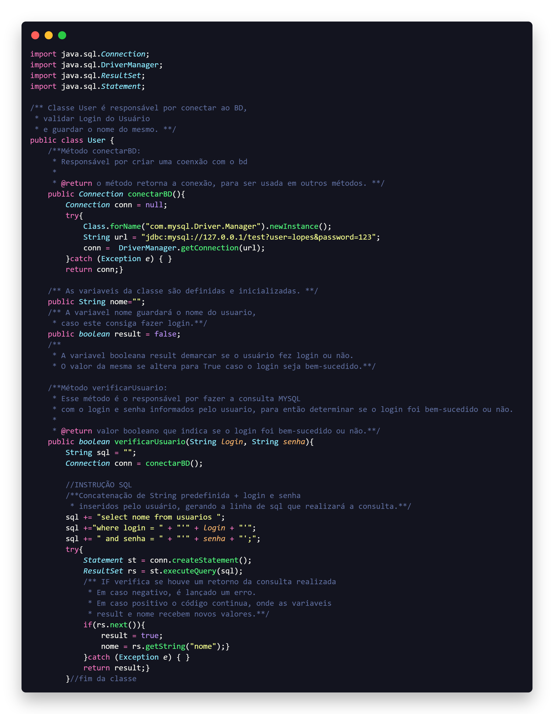

# Teste de Caixa Branca 
# ETAPA 3

Esta representa a terceira etapa da Atividade de Teste de Caixa Branca da disciplina "Qualidade e Testes de Software". Nesta fase, o objetivo é desenvolver documentação para a classe Java fornecida, incorporando-a diretamente no próprio código-fonte.

