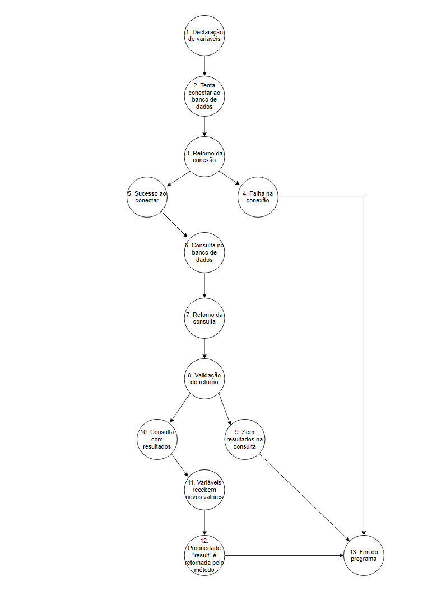

# Teste de Caixa Branca

# ETAPA 2

## Grafo de Fluxo

## Complexidade ciclomática 
- CC = (Arestas - Nós) + 2
- (14 - 13) + 2
- (1) + 2
- Complexidade Ciclomática = 3

## Caminhos
### Os caminhos possíveis são:
- Caminho 1 = 1; 2; 3; 4; 13.
- Caminho 2 = 1; 2; 3; 5; 6; 7; 8; 9; 13.
- Caminho 3 = 1; 2; 3; 5; 6; 7; 8; 10; 11; 12; 13.
